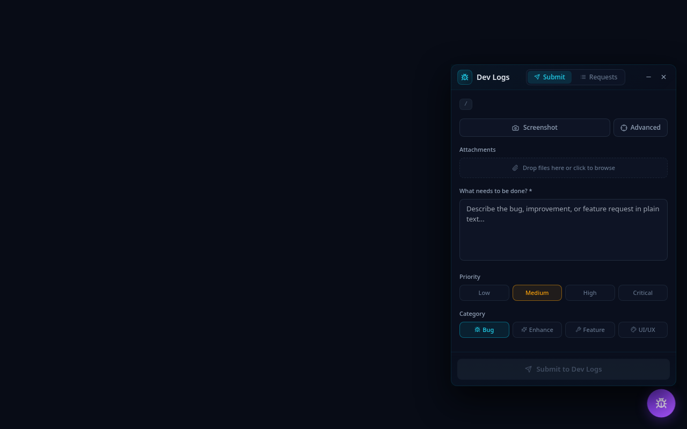
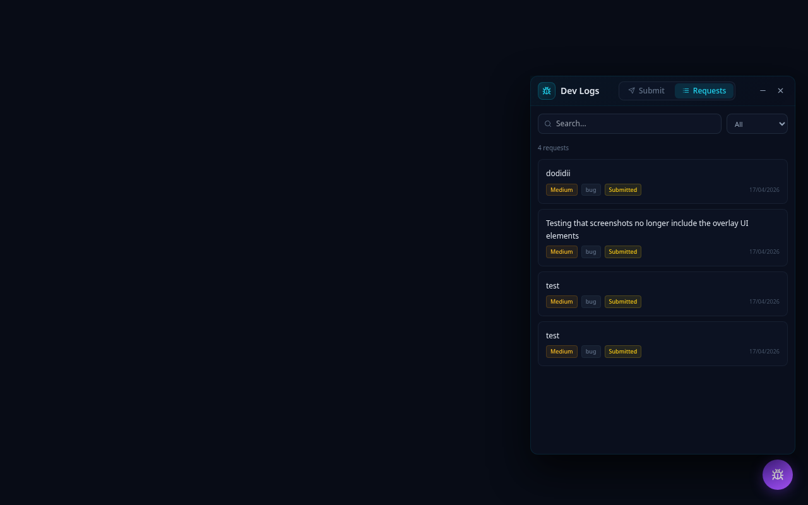
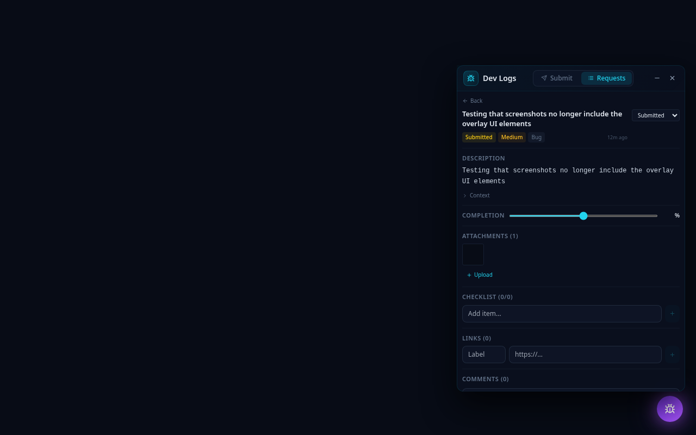
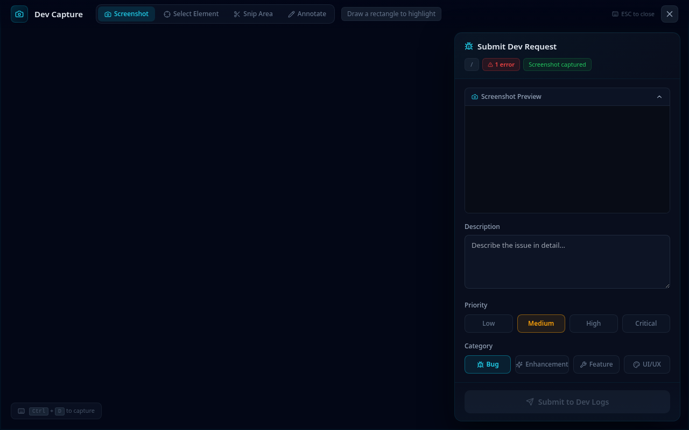

<p align="center">
  
</p>

<h1 align="center">dev-logs</h1>

<p align="center">
  <strong>AI-centric dev submission and tracking platform</strong><br/>
  Capture bugs, features, and improvements with rich context — screenshots, console logs, element metadata, file attachments, and annotations — so AI can immediately start working on submitted requests.
</p>

<p align="center">
  <a href="https://www.npmjs.com/package/@hemangjoshi37a/dev-logs"></a>
  <a href="https://www.npmjs.com/package/@hemangjoshi37a/dev-logs"></a>
  <a href="https://github.com/hemangjoshi37a/dev-logs"></a>
  <a href="https://github.com/hemangjoshi37a/dev-logs/blob/main/LICENSE"></a>
</p>

<p align="center">
  <a href="#features">Features</a> •
  <a href="#screenshots">Screenshots</a> •
  <a href="#quick-start">Quick Start</a> •
  <a href="#integration">Integration</a> •
  <a href="#architecture">Architecture</a> •
  <a href="#api">API</a> •
  <a href="#license">License</a>
</p>

<br/>

<div align="center">

```bash
npx @hemangjoshi37a/dev-logs
```


**One command. Zero config. Instant bug tracking.**

</div>

<br/>

---

## Features

- **Floating Bug Button** — Non-intrusive overlay for any web app. Toggle with `Ctrl+D`
- **Draggable & Resizable Panel** — Move and resize the floating panel anywhere on screen
- **Rich Context Capture** — Auto-captures screenshots, console errors/warnings, viewport, URL, user agent
- **Advanced Capture Mode** — Full-screen overlay with 4 modes:
  - **Screenshot** — Draw highlight rectangles on the page
  - **Element Picker** — Click DOM elements to capture tag, classes, selector, dimensions
  - **Snip Area** — Crop specific regions of the page
  - **Annotate** — Freehand drawing on screenshots with color/width controls
- **File Attachments** — Drag & drop or browse to attach images, logs, text files, or anything
- **Full Ticket Tracking** — Status lifecycle: `submitted → in-progress → in_testing → completed`
- **Checklists** — Break down work items with completion tracking
- **Comments** — Threaded discussion with author names and relative timestamps
- **Links** — Attach reference URLs to any request
- **Testing Notes & Feedback** — Dedicated fields for QA and stakeholder input
- **Completion Tracking** — Slider-based percentage tracking per request
- **Search & Filter** — Find requests by text, filter by status
- **AI-Ready** — Structured JSON output with full context for AI consumption
- **Zero Config Storage** — JSON file storage, no database needed
- **Clean Screenshots** — All overlay UI is hidden during page capture

## Screenshots

### Floating Bug Button
The non-intrusive purple bug button sits in the corner of your app. Click it or press `Ctrl+D` to open the panel.


### Submit Tab
Describe the issue in plain text, set priority and category, attach files, and capture screenshots.



### Request List
Browse all submitted requests with search, status filtering, and priority/category badges.



### Request Detail
Full ticket view with description, completion slider, attachments, checklist, links, comments, testing notes, and feedback.



### Advanced Capture
Full-screen overlay with Screenshot, Element Picker, Snip Area, and Annotate modes for rich context capture.



## Quick Start

### One command — that's it

```bash
npx @hemangjoshi37a/dev-logs
```

Opens the dev-logs server at **http://localhost:4445** — dashboard, API, and overlay all in one.

### Options

```bash
npx @hemangjoshi37a/dev-logs --port 5000          # Custom port
npx @hemangjoshi37a/dev-logs --data ./my-data     # Custom data directory
npx @hemangjoshi37a/dev-logs --help               # Show all options
```

### Install globally (optional)

```bash
npm install -g @hemangjoshi37a/dev-logs
dev-logs
```

### From source (for development)

```bash
git clone https://github.com/hemangjoshi37a/dev-logs.git
cd dev-logs
npm install
npm run dev    # Frontend on :4444, Backend on :4445
```

### First Run
1. Open **http://localhost:4445** in your browser
2. Click the purple bug button (bottom-right) or press `Ctrl+D`
3. Describe your issue, set priority/category
4. Optionally capture a screenshot or attach files
5. Click "Submit to Dev Logs"
6. Switch to the "Requests" tab to view and manage submissions

## Integration

### Add to any web app

Inject the overlay into your application during development:

```html
<!-- Add this single line to your app's HTML -->
<script src="http://localhost:4445/overlay.js"></script>
```

The floating bug button appears at the bottom-right. Press **Ctrl+D** to open the capture overlay. All submissions go to your dev-logs server.

### Remove for production

Simply remove the `<script>` tag — zero footprint in production.

### Auto-inject only in development

```html
<script>
  if (location.hostname === 'localhost' || location.hostname === '127.0.0.1') {
    const s = document.createElement('script');
    s.src = 'http://localhost:4445/overlay.js';
    document.head.appendChild(s);
  }
</script>
```

### Vite plugin (one-liner)

```js
// vite.config.ts
export default defineConfig({
  plugins: [
    {
      name: 'dev-logs',
      transformIndexHtml: (html) =>
        process.env.NODE_ENV !== 'production'
          ? html.replace('</head>', '<script src="http://localhost:4445/overlay.js"></script></head>')
          : html,
    },
  ],
});
```

## Architecture

```
┌─────────────────────────┐     ┌──────────────────────────┐
│   YOUR WEB APP          │     │   DEV-LOGS SERVER        │
│                         │     │                          │
│   ┌──────────────────┐  │     │   Frontend (React/Vite)  │
│   │  <script>        │──┼────►│   http://localhost:4444  │
│   │  overlay.js      │  │     │                          │
│   └──────────────────┘  │     │   Backend (Express)      │
│                         │     │   http://localhost:4445   │
│   🐛 Bug Button         │     │                          │
│   (captures context)    │────►│   /api/requests          │
│                         │     │   JSON file storage      │
└─────────────────────────┘     └──────────────────────────┘
```

### Tech Stack

| Layer | Technology |
|-------|-----------|
| Frontend | React 19 + TypeScript + Vite + Tailwind CSS |
| UI Components | Radix UI + Lucide Icons + Framer Motion |
| Backend | Node.js + Express + TypeScript |
| Storage | JSON files (zero config, no database) |
| Screenshots | html-to-image |
| Overlay | Self-contained IIFE bundle |

### Project Structure

```
dev-logs/
├── src/                    # React frontend
│   ├── App.tsx             # Main app (panel + bug button + capture)
│   ├── components/
│   │   ├── FloatingPanel.tsx    # Draggable/resizable panel
│   │   ├── SubmitTab.tsx        # New request form
│   │   ├── RequestList.tsx      # Request list with search/filter
│   │   ├── RequestDetail.tsx    # Full request detail view
│   │   ├── DevCapture.tsx       # Advanced full-screen capture
│   │   └── FloatingBugButton.tsx
│   ├── lib/api.ts          # API client
│   └── types/index.ts      # TypeScript types
├── server/                 # Express backend
│   ├── index.ts            # Server entry
│   └── routes/requests.ts  # All API routes
├── overlay/                # Injectable overlay script
│   └── index.ts
└── docs/screenshots/       # UI screenshots
```

## Scripts

```bash
npm run dev          # Start frontend + backend concurrently
npm run dev:client   # Start frontend only (Vite, port 4444)
npm run dev:server   # Start backend only (Express, port 4445)
npm run build        # Build frontend for production
npm run build:overlay # Build overlay.js bundle
```

## API

All endpoints prefixed with `/api/requests`:

| Method | Path | Description |
|--------|------|-------------|
| `GET` | `/` | List requests (filter: `status`, `priority`, `category`) |
| `POST` | `/` | Create request |
| `GET` | `/:id` | Get request detail |
| `PUT` | `/:id` | Update request |
| `DELETE` | `/:id` | Delete request |
| `POST` | `/:id/checklist` | Add checklist item |
| `PUT` | `/:id/checklist/:cid` | Toggle checklist |
| `POST` | `/:id/comments` | Add comment |
| `POST` | `/:id/links` | Add reference link |
| `POST` | `/:id/attachments` | Upload file attachment |
| `GET` | `/:id/attachments/:file` | Serve attachment |
| `PUT` | `/:id/feedback` | Update testing notes/feedback |
| `PATCH` | `/:id/completion` | Update completion percentage |
| `GET` | `/changelog` | Activity changelog |

### Request Schema

```json
{
  "id": "REQ-001",
  "title": "Auto-generated from description",
  "description": "User's plain text description\n---\nAuto-captured context metadata",
  "status": "submitted",
  "priority": "high",
  "category": "bug",
  "created_at": "2026-04-17T09:00:00.000Z",
  "checklist": [{ "id": "c1", "text": "Fix the issue", "checked": false }],
  "attachments": [{ "id": "att-1", "filename": "screenshot.png", "url": "/api/..." }],
  "comments": [{ "id": "cmt-1", "text": "Looking into this", "author": "dev" }],
  "links": [{ "label": "Related PR", "url": "https://..." }],
  "completion_percentage": 50,
  "testing_notes": "Verified on Chrome and Firefox",
  "feedback": "Looks good, ship it"
}
```

## Why dev-logs?

Traditional bug tracking tools (Jira, Linear, GitHub Issues) require context-switching — leave your app, open the tracker, describe the issue from memory, manually attach screenshots. By the time you submit, you've lost half the context.

**dev-logs** captures everything in-situ:
- Screenshot of exactly what you're looking at
- Console errors that just happened
- The exact element you're pointing at (with CSS selector, dimensions, text)
- Your viewport size and browser info
- All with zero context-switching

And because it outputs structured JSON with full metadata, AI tools (Claude, GPT, Copilot) can immediately understand and start working on the request — no ambiguity, no back-and-forth.

## License

MIT

---

## 📬 Contact

**Hemang Joshi** — Founder, [hjLabs.in](https://hjlabs.in)

[](mailto:hemangjoshi37a@gmail.com)
[](https://www.linkedin.com/in/hemang-joshi-046746aa)
[](https://www.youtube.com/@HemangJoshi)
[](https://wa.me/917016525813)
[](https://t.me/hjlabs)

<br/>

**hjLabs.in** — Industrial Automation | AI/ML | IoT | SEO Tools

Serving **15+ countries** with a **4.9⭐ Google rating**

[](https://hjlabs.in)
[](https://github.com/hemangjoshi37a)
[](https://linktr.ee/hemangjoshi37a)

<br/>

---

<sub>Built with ❤️ by <a href="https://hjlabs.in">hjLabs.in</a> — Open source dev tools for everyone</sub>

<br/>

⭐ **If this project helps you, please give it a star!** ⭐
